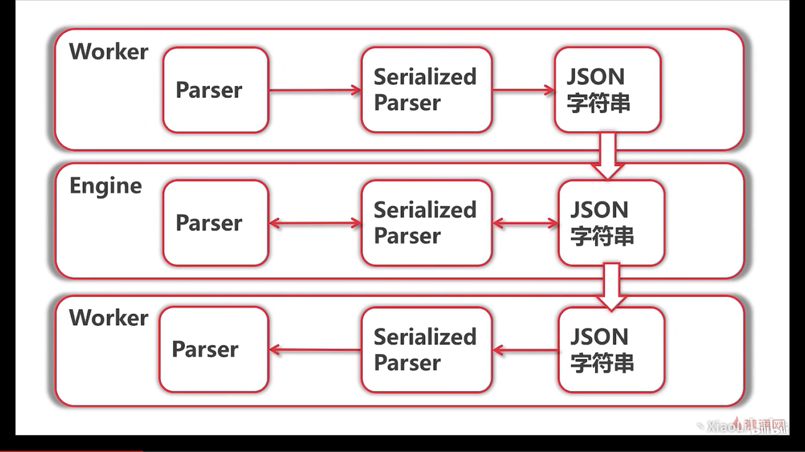

RPC 三要素：
1. RPC Handler/Endpoint
2. RPC Server
3. RPC Client

# p86 分布式-解析器的序列化
在处理 Worker RPC Service 之前，需要解决序列化/反序列化问题：

1. Worker 里有解析器函数 `Parser`，但不能在网络上直接传，
2. 需要通过 `Serialized Parser` 序列化成 JSON 字符串来传，
3. `Serialized Parser` 是结构体，里面是要传输的字段，
4. 比如函数名、函数参数 `{"FuncName": "ParseCity", "URL":"aaa"}`,
5. 另一端 Engine 收到后，反序列化，知道了该用什么 Parser 函数和参数，
6. 再将结果序列化传给 Worker 的 Parser

# p87 - 88
1. Worker RPC Handler : `Worker` 接收 `Request`，返回 `ParseResult`
    1. `Request` 和 `ParseResult` 需要序列化/反序列化
